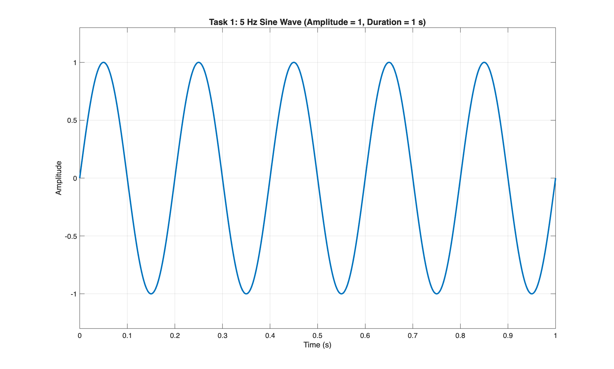
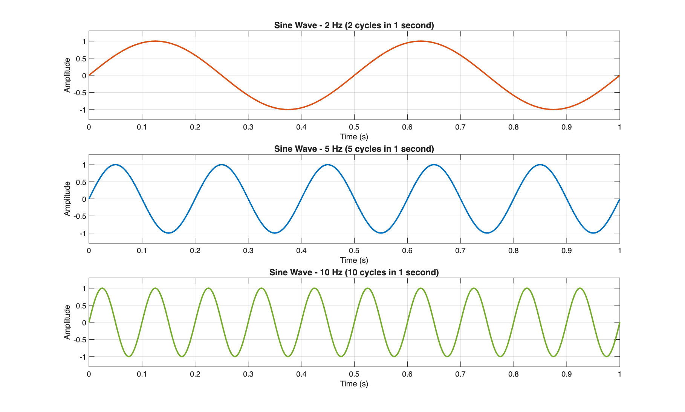
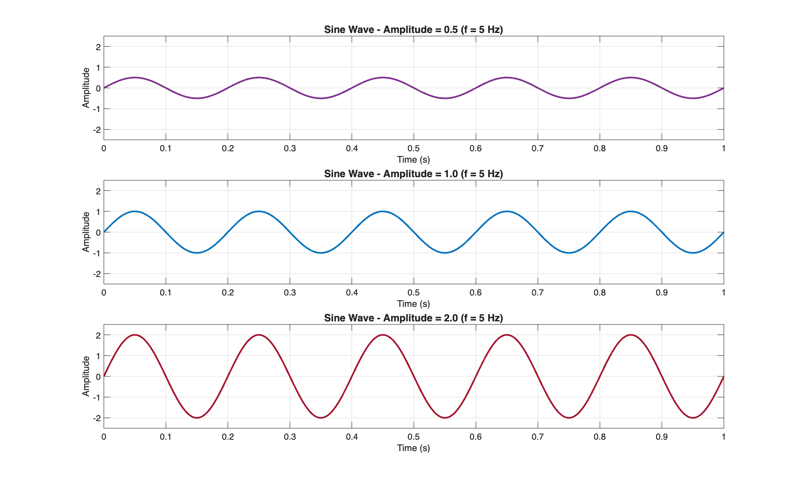
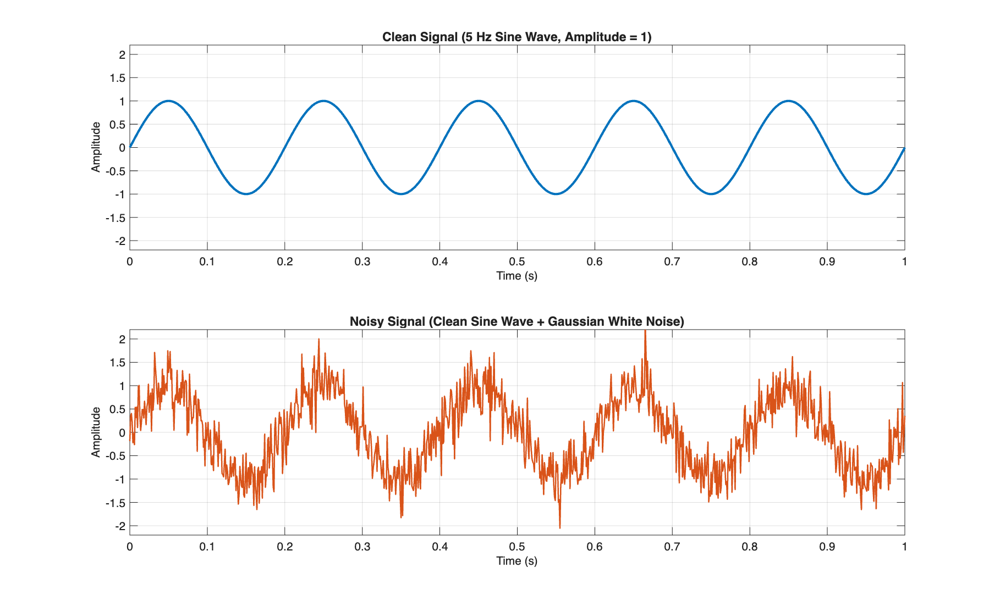

# Lecture 01: Signal Visualization in MATLAB

This directory contains the MATLAB implementation and analysis for **Lecture 01: Signal Visualization**, covering fundamental continuous and discrete-time signal representations, frequency variations, amplitude scaling, and noise modeling.

---

## Files

- [`Lecture01_signal_visualization.m`](file:///Users/tetrex/Documents/Digital-Signal-Processing/Lecture01/Lecture01_signal_visualization.m) — Complete MATLAB script executing Tasks 1 to 4 and exporting the resulting plots.
- `figures/` — Directory containing high-resolution PNG plots generated by the script:
  - `task1_sine_wave.png`
  - `task2_frequency_comparison.png`
  - `task3_amplitude_comparison.png`
  - `task4_clean_vs_noisy.png`

---

## How to Run the Script

Open MATLAB and navigate to this directory, or run the following command in terminal:

```bash
matlab -batch "run('Lecture01_signal_visualization.m')"
```

---

## Task 1: Create a Sine Wave

### Specifications
- **Amplitude ($A$):** $1$
- **Frequency ($f$):** $5\text{ Hz}$
- **Duration ($T$):** $1\text{ s}$
- **Sampling Frequency ($f_s$):** $1000\text{ Hz}$ ($dt = 0.001\text{ s}$)
- **Mathematical Expression:** $y(t) = A \cdot \sin(2\pi f t) = 1 \cdot \sin(10\pi t)$

### Plot


---

## Task 2: Compare Different Frequencies

### Specifications
Three sine waves generated over a $1.0\text{ s}$ interval with amplitude $A = 1$:
1. $f_1 = 2\text{ Hz} \implies y_1(t) = \sin(4\pi t)$
2. $f_2 = 5\text{ Hz} \implies y_2(t) = \sin(10\pi t)$
3. $f_3 = 10\text{ Hz} \implies y_3(t) = \sin(20\pi t)$

### Plot


### Questions & Answers

#### 1. Which signal changes fastest?
> **Answer:** The **$10\text{ Hz}$ signal** changes fastest.
>
> **Explanation:** Frequency ($f$) represents the number of complete oscillations per unit of time ($1\text{ second}$). The first derivative with respect to time $\frac{dy}{dt} = 2\pi f \cos(2\pi f t)$ reaches a maximum magnitude of $2\pi f$. For $10\text{ Hz}$, the maximum rate of change is $20\pi \approx 62.83\text{ units/s}$, compared to $10\pi \approx 31.42\text{ units/s}$ for $5\text{ Hz}$ and $4\pi \approx 12.57\text{ units/s}$ for $2\text{ Hz}$. Therefore, the slope and oscillation rate are steepest for $10\text{ Hz}$.

#### 2. Which signal has the lowest frequency?
> **Answer:** The **$2\text{ Hz}$ signal** has the lowest frequency.
>
> **Explanation:** It completes only $2$ full cycles in $1\text{ second}$, corresponding to the longest period $T = \frac{1}{f} = \frac{1}{2} = 0.5\text{ seconds}$ per cycle.

#### 3. How can you see the difference in the plots?
> **Answer:** 
> - **Cycle Count:** Counting the number of full wave periods (or crest-to-crest peaks) across the $1$-second horizontal axis:
>   - The top plot ($2\text{ Hz}$) has **$2$ cycles** ($T = 0.5\text{ s}$).
>   - The middle plot ($5\text{ Hz}$) has **$5$ cycles** ($T = 0.2\text{ s}$).
>   - The bottom plot ($10\text{ Hz}$) has **$10$ cycles** ($T = 0.1\text{ s}$).
> - **Oscillation Density:** As frequency increases, the waves appear much more compressed horizontally (higher density of oscillations) within the same 1-second time window.

---

## Task 3: Compare Different Amplitudes

### Specifications
Three sine waves generated with a fixed frequency $f = 5\text{ Hz}$ and varying amplitudes:
1. $A_1 = 0.5 \implies y(t) = 0.5 \cdot \sin(10\pi t)$
2. $A_2 = 1.0 \implies y(t) = 1.0 \cdot \sin(10\pi t)$
3. $A_3 = 2.0 \implies y(t) = 2.0 \cdot \sin(10\pi t)$

### Plot


### Questions & Answers

#### 1. Which signal has the largest amplitude?
> **Answer:** The signal with **amplitude $= 2.0$** has the largest amplitude.
>
> **Explanation:** Its values oscillate between peak $+2.0$ and trough $-2.0$, yielding a peak-to-peak amplitude ($V_{pp}$) of $4.0$.

#### 2. Does changing amplitude change frequency?
> **Answer:** **No.** Changing the amplitude does **not** change the frequency.
>
> **Explanation:** Amplitude only scales the signal vertically along the Y-axis (energy/magnitude). The frequency is governed solely by the argument inside the sinusoidal function ($2\pi f t$). All three subplots cross zero at the exact same time instances ($t = 0, 0.1, 0.2, \dots$) and complete exactly $5$ full cycles per second.

#### 3. Give one real-world example where amplitude is important.
> **Answer:** 
> - **Audio and Acoustics (Loudness/Volume):** In sound reproduction, the amplitude of the electrical audio wave sent to a speaker directly determines the sound pressure level (volume/loudness) heard by the listener. Increasing the amplitude makes the sound louder without altering the pitch or musical note (which is determined by frequency).
> - *Other examples include:* **Amplitude Modulation (AM Radio)** where audio information is encoded directly into the amplitude variations of the radio frequency carrier, and **Biomedical Monitoring (ECG/EEG)** where signal amplitude indicates cardiac or neural electrical activity strength.

---

## Task 4: Add Noise

### Specifications
- **Clean Signal:** $y_{\text{clean}}(t) = 1 \cdot \sin(2\pi \cdot 5 \cdot t)$
- **Noise:** Additive White Gaussian Noise (AWGN) generated via `randn` with standard deviation $\sigma = 0.35$.
- **Noisy Signal:** $y_{\text{noisy}}(t) = y_{\text{clean}}(t) + \eta(t)$, where $\eta(t) \sim \mathcal{N}(0, \sigma^2)$.

### Plot


### Questions & Answers

#### 1. What changed after adding noise?
> **Answer:** 
> - The smooth, continuous, and predictable sinusoidal profile was replaced by rapid, jagged, and random variations.
> - High-frequency fluctuations are superimposed onto every sample, degrading signal smoothness and introducing instantaneous amplitude deviations from the ideal trajectory.

#### 2. Can you still recognize the original signal?
> **Answer:** **Yes.**
>
> **Explanation:** Even though the instantaneous values are distorted, the underlying periodic structure and general sinusoidal contour remain clearly visible. One can still clearly count the $5$ primary peaks and troughs across the $1$-second duration because the Signal-to-Noise Ratio (SNR) remains sufficiently high.

#### 3. Give one real-world source of signal noise.
> **Answer:** 
> - **Thermal Noise (Johnson–Nyquist Noise):** Caused by the random thermal agitation of charge carriers (electrons) inside electronic conductors, resistors, and semiconductor devices. It is present in all electrical circuits and measurement sensors regardless of external shielding.
> - *Other real-world sources include:* **Electromagnetic Interference (EMI)** from power lines ($50\text{ Hz} / 60\text{ Hz}$ mains hum), radio frequency interference (RFI) from wireless devices, and environmental/sensor acoustic noise in microphone recordings.
